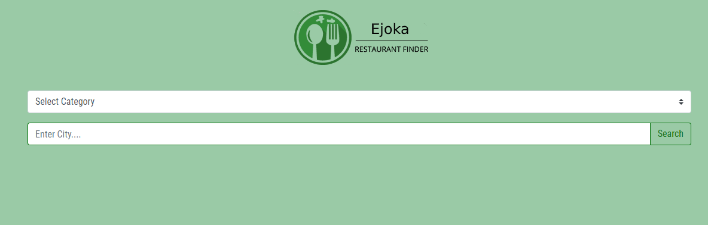

# Project: Restaurant Finder Using Zomato API

> This is a practice project on fetching data from the API. The API used is from a restaurant finder called Zomato. The app searches for restaurants in the selected category and city, and displays restaurants available for the chosen category in the city.

## Built With

- HTML
- CSS
- java script
- Webpack
- Bootstrap
- Zomato API

## Live Version

[Live Link](https://emmanuelkamala.github.io/ejokaRestaurantFinder/)

## Getting Started

Open your terminal or text editor and use next command

        git clone https://github.com/emmanuelkamala/ejokaRestaurantFinder.git

        cd ejokaRestaurantFinder

After if you want to do any changes please create new branch, after changes open pull request.
Happy coding! 

## Author

👤 **Author**

- Github: [emmanuelkamala](https://github.com/emmanuelkamala)
- Twitter: [ejkamala](https://twitter.com/ejkamala)
- Linkedin: [emmanuelkamala](https://linkedin.com/in/emmanuelkamala)

## 🤝 Contributing

Contributions, issues and feature requests are welcome!

Feel free to check the [issues page](issues/).

## Show your support

Give a ⭐️ if you like this project!

## Acknowledgments

- The odin project
- Microverse tips

## 📝 License

This project is [MIT](lic.url) licensed.